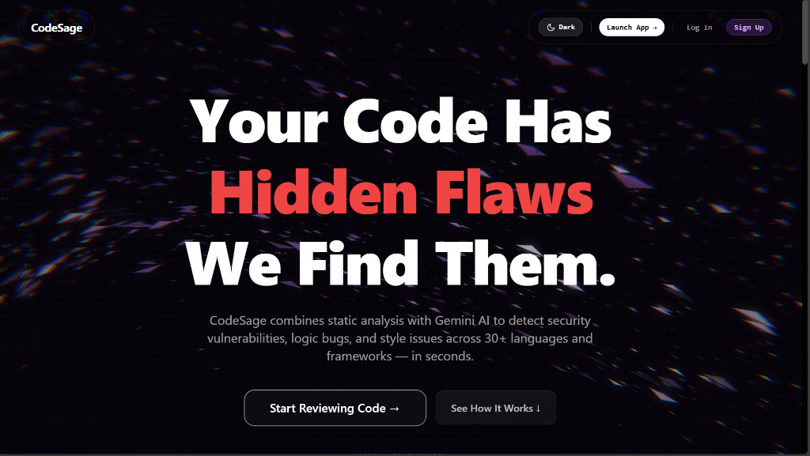
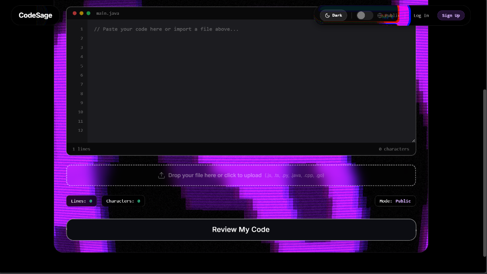
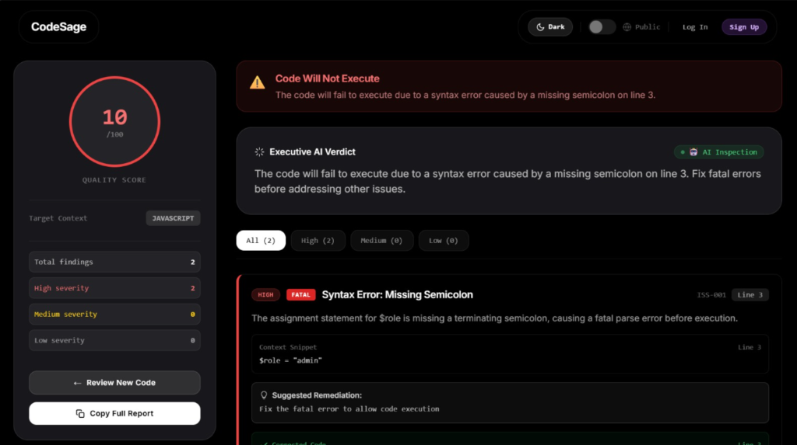

# CodeSage 🧙‍♂️

[](LICENSE)
[](https://nodejs.org/)
[](https://react.dev/)
[](https://expressjs.com/)
[](https://ai.google.dev/)
[](https://osv.dev/)

CodeSage is an AI-powered code review and static analysis engine built for modern development teams and "vibecoders". It combines deterministic regex pattern rules, real-time OSV.dev vulnerability scanning across 7 package ecosystems, language-agnostic code duplication detection, and Google Gemini cross-file reasoning to surface critical security vulnerabilities, logic flaws, and code smells.

---

## 🌐 Website Overview

### 📸 Visual Showcase


*The hero section featuring the core value proposition "Your Code Has Hidden Flaws, We Find Them" and quick start entry points.*


*The paste/upload/repo-URL mode switcher and code editor interface.*


*The issues list displaying detailed findings with severity tags, source badges, and recommended fixes.*

### ✨ Key Features

| Feature | Details | Benefit |
| :--- | :--- | :--- |
| **Whole-Repo Analysis** | GitHub URL input, cross-file reasoning via Gemini | Uncovers architecture inconsistencies and multi-file logic bugs across the repository |
| **Verified CVE Scanning** | OSV.dev, 7 package ecosystems: npm, PyPI, Go, Rust, RubyGems, Packagist, Maven | Detects known vulnerabilities in project dependencies with live CVE database validation |
| **Language-Agnostic Duplication Detection** | 6-line sliding window, works across any language | Pinpoints duplicate code blocks and copy-paste debt regardless of syntax |
| **AI + Static Hybrid** | Gemini reasoning combined with deterministic checks | Delivers immediate regex vulnerability feedback backed by AI semantic analysis |
| **Private Mode** | On-device WASM/WebLLM option, code never leaves the browser | Guarantees complete data privacy and zero cloud transmission for sensitive source code |
| **Vibecoder-Focused Findings** | Flags AI-generated code smells: missing error handling, hardcoded config, inconsistent patterns | Cleans up AI-assisted code before pushing to production |

### 🆚 CodeSage vs. Traditional Tools

| Capability | IDE/Linter | CodeSage |
| :--- | :--- | :--- |
| **Cross-File Reasoning** | No, single-file only | Yes, whole-repo context |
| **Verified Vulnerability Data** | No | Yes, real OSV.dev CVEs |
| **Intent/Logic Bug Detection** | Syntax only | Reasons about what code is trying to do |
| **Privacy Option** | N/A | On-device WASM mode available |
| **Cost** | Often paid tiers for advanced checks | Free, open source |

### 🏗️ Architecture Overview

```
+-----------------------------------------------------------------------------------+
|                                   User Browser                                    |
+-----------------------------------------------------------------------------------+
                                          |
                                          v
+-----------------------------------------------------------------------------------+
|             React Frontend (paste / upload / repo URL mode switcher)              |
+-----------------------------------------------------------------------------------+
                                          |
                                          v
+-----------------------------------------------------------------------------------+
|                                 Express Backend                                   |
+-----------------------------------------------------------------------------------+
                                          |
                   +----------------------+----------------------+
                   |                                             |
                   v                                             v
+------------------------------------+ +--------------------------------------------+
|         Single-File Review         | |            Whole-Repo Pipeline            |
|              (Gemini)              | |  1. GitHub API fetch                     |
+------------------------------------+ |  2. OSV.dev CVE scan                       |
                   |                   |  3. Duplication detector                   |
                   |                   |  4. Gemini repo analysis                   |
                   |                   |  5. Merged results                         |
                   |                   +--------------------------------------------+
                   |                                             |
                   +----------------------+----------------------+
                                          |
                                          v
+-----------------------------------------------------------------------------------+
|                                 Results Dashboard                                 |
+-----------------------------------------------------------------------------------+
```

---

## ⚙️ Getting Started

### Prerequisites

- **Node.js** (v18 or higher recommended)
- **npm** (v9 or higher)
- **Google Gemini API Key** (optional for AI reasoning; static analysis works standalone)

### Environment Setup

Create a `.env` file in the project root:

```env
PORT=3000
GEMINI_API_KEY=your_gemini_api_key_here
```

### Installation & Running Locally

1. **Install Root Dependencies:**
   ```bash
   npm install
   ```

2. **Install Frontend Dependencies:**
   ```bash
   cd frontend
   npm install
   cd ..
   ```

3. **Start Backend Server:**
   ```bash
   npm run dev
   ```

4. **Start Frontend Development Server:**
   ```bash
   cd frontend
   npm run dev
   ```
